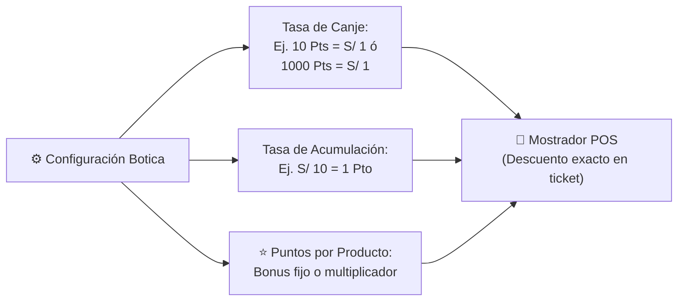

# 🏗️ PLAN MAESTRO DE CONSTRUCCIÓN FRONTEND v2.0 (VALETEC PHARMA)

Este plan rige la **arquitectura visual, diseño de pantallas completas (Full-Page SaaS Workspaces), cableado de eventos y modernización de interfaces** bajo las 10 reglas de oro permanentes.

---

## 📜 1. Las 10 Reglas de Oro Inviolables (Permanentes)

1. **Buenas prácticas:** Arquitectura limpia, semántica, modular, legible y mantenible.
2. **Cero push sin permiso:** Ningún commit ni push a GitHub sin indicación expresa del usuario.
3. **Backend 100% intocable:** El backend de Node.js/PostgreSQL se mantiene intacto (`server/` no se modifica).
4. **Mapeo perfecto de botones y eventos:** Cada botón, switch, atajo de teclado (`F-keys`, `ESC`) y drawer debe estar completamente cableado sin botones mudos o rotos.
5. **Detención ante dudas:** Cualquier error, ambigüedad o decisión detiene inmediatamente la ejecución para consultar al usuario.
6. **Pruebas controladas:** Solo se ejecutan pruebas cuando el usuario lo solicite explícitamente (al finalizar módulos completos).
7. **Paso a paso (Submódulo por submódulo):** Trabajo secuencial y minucioso, verificando cada entrega antes de pasar a la siguiente.
8. **Cero divagaciones:** Foco absoluto y estricto en la tarea inmediata.
9. **Autorización previa:** Se requiere la autorización explícita del usuario ("dale" o "procede") antes de modificar código en cada paso.
10. **Persistencia total:** Estas 10 reglas rigen permanentemente durante todo el proyecto.

---

## 🌟 2. Directriz de Diseño: Pantallas Completas (Full-Page SaaS Workspaces)

> [!IMPORTANT]
> **No más menús vacíos ni submenús flotantes superficiales:**
> Cada uno de los submódulos de la aplicación se diseña como una **pantalla operativa completa e integral** de alta densidad visual (SaaS 2026):
>
> 1. **Header de Control:** Título semántico, subtítulo operativo y grupo de botones de acción rápida (`.btn-primary`, `.btn-secondary`).
> 2. **Banda de KPIs en Tiempo Real:** 3 a 4 tarjetas analíticas superiores con métricas vivas y colores temáticos.
> 3. **Barra de Herramientas y Filtros:** Buscador predictivo reactivo, selectores de rango y pestañas segmentadas (`tabs`) con conteos en vivo.
> 4. **Área de Operación Principal:**
>    - Para catálogos/registros: Tablas SaaS de alta densidad con paginación, ordenamiento, badges de estado y acciones por fila.
>    - Para ventas: Workspace a doble panel ergonómico (Catálogo táctil/lector + Ticket de mostrador en tiempo real).
>    - Para arqueos: Matriz visual de billetes y monedas peruanas con cálculo instantáneo de sobrante/faltante.
> 5. **Paneles Laterales Deslizantes (`.drawer`):** Formularios de captura y edición de 560px a 720px que no descolocan al operador de la pantalla de trabajo.

---

## 🎁 3. Motor Configurable de Fidelización y Puntos (Ajustable por Botica)

Para adaptarse a cualquier modelo de negocio farmacéutico (desde cadenas hasta boticas independientes), el sistema de puntos se transforma en un **motor 100% dinámico y parametrizable**:



### Características del Motor de Fidelización:
1. **Regla de Canje Personalizable (Puntos a Dinero):**
   - Campo configurable por el administrador: `[ X ] Puntos = S/ 1.00 de descuento`.
   - Permite tanto esquemas tradicionales (`10 Pts = S/ 1.00`) como esquemas de alto volumen (`1,000 Pts = S/ 1.00` o `500 Pts = S/ 1.00`).
2. **Regla de Acumulación Personalizable (Compras a Puntos):**
   - Campo configurable: `S/ [ X ] en compras generan [ Y ] Puntos`.
3. **Puntos Bonificados por Producto Individual:**
   - En el Drawer de Producto (`#productDrawer`), se añade la sección de fidelización:
     - `[ Switch ] Otorgar Puntos Extra`: Permite definir puntos promocionales específicos para ese medicamento (ej. "+50 Pts extra" al llevar Colágeno o Vitamina C).
     - Visualización en el catálogo del POS para que el cajero incentive la compra ofreciendo los puntos de promoción.
4. **Niveles de Lealtad (Tiers) con Descuento Automático:**
   - Parámetros editables para umbrales de clientes **Bronce**, **Plata** y **Oro** con sus respectivos descuentos automáticos.

---

## 🗺️ 4. Mapa Maestro de Navegación y Vistas Completas

```
┌────────────────────────────────────────────────────────────────────────────────────────────────┐
│ BARRA LATERAL (9 MÓDULOS)   │ PANTALLA COMPLETA DE TRABAJO (FULL-PAGE SAAS WORKSPACE)          │
├─────────────────────────────┼──────────────────────────────────────────────────────────────────┤
│ 📊 1. DASHBOARD             │ KPIs ejecutivos, gráficos de facturación, fármacos más vendidos.  │
│ ⚡ 2. VENTAS                │                                                                  │
│    ├── Mostrador POS        │ Workspace a 2 columnas (Catálogo + Ticket, F-keys, canje puntos) │
│    └── Comprobantes         │ Historial de ventas del turno, reimpresión 80mm, reenvío SUNAT.  │
│ 💵 3. CAJA                  │                                                                  │
│    ├── Arqueo               │ Matriz interactiva de monedas y billetes (Sobrante/Faltante).    │
│    ├── Apertura             │ Asignación de fondo inicial de cambio por turno y cajero.        │
│    ├── Gastos               │ Registro de egresos menores y caja chica con motivo y recibo.   │
│    └── Cierre Z             │ Balance final de jornada, acta fiscal y bloqueo de turno.        │
│ 👥 4. CLIENTES              │                                                                  │
│    ├── Directorio           │ Padrón DNI/RUC, drawer de alta, historial de compras de cliente. │
│    └── Motor de Puntos      │ Panel de configuración de reglas, tasas de canje y promociones. │
│ 📦 5. INVENTARIO            │                                                                  │
│    ├── Productos            │ Catálogo maestro con 3 presentaciones (Caja/Blíster/Unidad).     │
│    ├── Lotes FEFO           │ Semáforo preventivo de vencimiento y bloqueo de lotes críticos.  │
│    ├── Kardex               │ Trazabilidad física de entradas, salidas y mermas por ítem.      │
│    ├── Categorías           │ Gestión de familias terapéuticas y laboratorios fabricantes.    │
│    └── Cuadre Stock         │ Módulo de auditoría física, escaneo y ajuste de diferencias.     │
│ 🚚 6. COMPRAS               │                                                                  │
│    ├── Ingresos Droguería   │ Registro guiado de factura/guía con costos y fechas de lotes.    │
│    ├── Proveedores          │ Directorio de droguerías, RUC, condiciones de crédito y plazos. │
│    └── Canjes / Mermas      │ Registro de medicamentos por vencer para devolución a proveedor. │
│ 📋 7. DIGEMID               │                                                                  │
│    ├── Recetas Retenidas    │ Libro oficial foliado de psicotrópicos con CMP y diagnóstico.    │
│    ├── Bóveda               │ Custodia bajo llave de estupefacientes y control de frascos.     │
│    └── Balances Sanitarios  │ Generación del informe oficial para inspectores de salud.        │
│ 📈 8. REPORTES              │                                                                  │
│    ├── Contador             │ Exportación mensual de ventas y compras (Excel/PDF con IGV).     │
│    └── Reposición           │ Sugerido automático de compras exportable para enviar a WhatsApp │
│ ⚙️ 9. AJUSTES               │                                                                  │
│    ├── Botica               │ RUC, Razón Social, logo, dirección, teléfono y director técnico. │
│    ├── Facturación SUNAT    │ Certificado digital, credenciales SOL y series de comprobantes.  │
│    ├── Personal & Roles     │ Usuarios, permisos estrictos (admin, qf, tech, cashier).         │
│    └── Backups              │ Exportación y respaldo de la base de datos PostgreSQL.          │
└────────────────────────────────────────────────────────────────────────────────────────────────┘
```

---

## 🧱 5. Cronograma de Construcción Secuencial (Submódulo por Submódulo)

### ✅ ETAPAS COMPLETADAS Y SINCRONIZADAS EN GITHUB:
* **ETAPA 0:** Cimientos, sistema de 3 botones, sistema de drawers y navegación lateral.
* **ETAPA 1:** Módulo de Inventario (5 submódulos probados y verificados).
* **ETAPA 2:** Módulo de Clientes (Directorio DNI/RUC y fidelización base probados con 22/22 PASS).
* **ETAPA 2.1:** Motor Configurable de Puntos & Fidelización (Drawer `#loyaltySettingsDrawer`, tasas dinámicas de canje/acumulación, tope de descuento por ticket, y bonificación de puntos promocionales en fármacos `#productDrawer`).
* **ETAPA 3:** Módulo de Ventas (Pantalla Completa de Mostrador POS con F-keys, acumulación de puntos, bonus promocionales, y Pantalla Completa SaaS de Comprobantes del Turno `#viewVouchers` con KPIs, filtros segmentados y anulación atómica).
* **ETAPA 4:** Módulo de Caja (Pantallas completas de Apertura de Turno con presets, Matriz Dual de Billetes y Monedas con autocalculador y reseteo, Tabla de Egresos y Caja Chica con categorización y búsqueda reactiva, y Cierre Z Fiscal oficial con comprobante térmico 80mm e interactividad antifraude). Probado 56/56 PASS (100%).
* **ETAPA 5:** Módulo de Compras & Droguerías (Pantalla Completa SaaS `#viewPurchases`, 4 KPIs, recepción de mercadería guiada `#receiveModal` con autocalculador IGV y enlace a Kardex, Drawer lateral `#supplierDrawer` para padrón oficial de droguerías con RUC 11 dígitos y condiciones de crédito, Visor modal de facturas comerciales `#invoiceDetailModal`, y gestión de Canjes FEFO `#purchasesPaneExchanges` con alertas de vigencia, impresión de cartas y solicitud vía WhatsApp). Probado 56/56 PASS (100%).
* **ETAPA 6:** Módulo DIGEMID - Control Sanitario (Pantalla Completa SaaS `#viewDigemid` con 4 KPIs sanitarios en tiempo real, 3 pestañas segmentadas; Submódulo 1: Libro Oficial de Recetas Retenidas con foliación correlativa, diagnóstico CIE-10, validación CMP y aprobación técnica Q.F.; Submódulo 2: Bóveda & Caja Fuerte de Psicotrópicos con monitoreo de T°/Humedad, padrón de controlados bajo llave y Acta de Arqueo Físico interactivo con sellado digital `#vaultAuditModal`; Submódulo 3: Balances Sanitarios Trimestrales DIRIS con reporte oficial membretado e imprimible `#digemidBalanceModal`). Probado 56/56 PASS (100%).
* **ETAPA 7:** Módulo de Reportes & Gerencia (Pantalla Completa SaaS `#viewManagement` con 3 pestañas segmentadas: Torre de Control con gráficos de evolución y Top Fármacos; Submódulo 1: Reporte Contable Mensual Formato SUNAT 14.1 con 4 KPIs tributarios de Base Imponible e IGV 18%, tabla desglosada, exportación oficial CSV/Excel con BOM UTF-8 e impresión; Submódulo 2: Sugerido Inteligente de Reposición a Droguerías con 4 KPIs de abastecimiento, cálculo de velocidad horaria, tabla de coberturas con cantidades editables en vivo y disparador directo de órdenes a WhatsApp `#whatsappOrderModal`). Probado 56/56 PASS (100%).
* **ETAPA 8:** Módulo de Ajustes & Configuración (Centro Integral de Ajustes `#settingsModal` con 4 pestañas segmentadas: Submódulo 1: Datos de la Botica con validación fiscal de RUC 11 dígitos, IGV 18%, licencia sanitaria DIRIS y pie de ticket; Submódulo 2: Facturación SUNAT con conmutador Beta/Producción, credenciales SOL, certificado digital PFX vigente con visor INDECOPI, series B001/F001/NC01 y test de ping a servidores SUNAT; Submódulo 3: Roles & Permisos RBAC con selector de puestos y matriz interactiva de 8 permisos operativos; Submódulo 4: Copias de Seguridad con monitor de PostgreSQL 16 y botón de descarga de dump `.sql` con 1 clic). Probado 56/56 PASS (100%).
* **ETAPA 9:** Dashboard Ejecutivo & Cierre de Integración 360° (Consolidación de la Torre de Control en `#viewManagement`, gráficos reactivos en Canvas con alternancia 14 días vs. Horas hoy, Top 5 rotación, auditoría antifraude en vivo, 0 emojis en interfaz core, validación de atajos de teclado F1-F9, widget nativo de accesibilidad universal Userway y suite de regresión 56/56 PASS en Docker PostgreSQL 16). Probado 56/56 PASS (100%).

---

### 📋 ETAPA 6: MÓDULO DIGEMID (CONTROL SANITARIO) (✅ COMPLETADA)
* **Submódulo 1: Libro de Recetas Retenidas:** Registro oficial foliado de psicotrópicos y estupefacientes (Lista IVB / Psicotrópicos) con número de receta, médico prescriptor, CMP, diagnóstico CIE-10, carga directa al POS y dispensación sellada.
* **Submódulo 2: Bóveda / Custodia:** Control de stock físico restringido con acceso restringido bajo supervisión del Químico Farmacéutico, monitoreo de temperatura y humedad, modal de conteo físico `#vaultAuditModal` y cálculo de descuadre en tiempo real.
* **Submódulo 3: Balances Sanitarios:** Generación automática de balances trimestrales exigidos por DIGEMID/DIRIS con entradas, salidas, saldos físicos y formato legal imprimible con sellos y colegiatura CQFP.

---

### 📈 ETAPA 7: MÓDULO DE REPORTES & GERENCIA (✅ COMPLETADA)
* **Submódulo 1: Reporte Contable SUNAT 14.1:** Registro Oficial de Ventas e Ingresos con cálculo exacto de Base Imponible Gravada e I.G.V. Débito Fiscal (18%), selector de periodo mensual, filtro de comprobantes (01 Factura / 03 Boleta), exportación descargable en CSV para Excel (con UTF-8 BOM para Windows) e impresión oficial de auditoría.
* **Submódulo 2: Sugerido Inteligente de Reposición a Droguerías:** Algoritmo de velocidad de agotamiento de stock (cobertura horaria <24h / <48h), 4 KPIs de compras (fármacos, inversión, droguerías, horas críticas), tabla reactiva con pedido sugerido editable en tiempo real, costeo dinámico e integración instantánea con modal y enlaces de WhatsApp para pedidos urgentes.

---

### ⚙️ ETAPA 8: MÓDULO DE AJUSTES & CONFIGURACIÓN (✅ COMPLETADA)
* **Submódulo 1: Datos de la Botica:** Razón Social oficial, Nombre Comercial, RUC (11 dígitos con validación estricta 10/20/15/17), Dirección Fiscal, teléfonos, email de contacto, moneda, IGV (18.00%), resolución y licencia sanitaria DIGEMID/DIRIS, Directora Técnica (Regente Q.F.) y leyenda al pie de comprobantes térmicos.
* **Submódulo 2: SUNAT & Facturación Electrónica:** Conmutador de entorno (Beta / Homologación vs. Producción oficial), credenciales secundarias SOL (Usuario y Clave con visibilidad alternable), tarjeta informativa del Certificado Digital PFX (Vigencia 2027, emisor LLAMA.PE INDECOPI, clave de almacén), series oficiales B001, F001, NC01 y botón de prueba de conexión TLS/ping con servidores SUNAT.
* **Submódulo 3: Personal & Roles (Matriz RBAC):** Selector interactivo de puestos (Dueño/Admin, Químico Regente, Técnico, Cajero) con matriz de 8 permisos operativos y acceso directo a la vista de gestión de trabajadores y turnos `#viewStaff`.
* **Submódulo 4: Copias de Seguridad (Backups):** Panel de diagnóstico de salud de PostgreSQL 16.2 en Docker (`valetec_pharma_postgres`), puerto 5442, verificación de 14 tablas relacionales activas, historial cronológico de volcados y descarga inmediata de respaldos `.sql` en 1 clic.

---

### 📊 ETAPA 9: DASHBOARD EJECUTIVO & INTEGRACIÓN 360° (✅ COMPLETADA)
* **Torre de Control Central:** Cockpit gerencial consolidado con facturación acumulada del día y mes, margen comercial ponderado, ticket promedio, lotes en riesgo FEFO (<90 días), gráfico interactivo dual de ventas (efectivo vs. digital) y ranking de medicamentos con mayor rotación en vivo desde PostgreSQL.
* **Auditoría Antifraude en Tiempo Real:** Stream de eventos con trazabilidad de cobros, salidas de caja chica y aperturas de turno.
* **Integración Completa del SaaS:** Los 9 módulos maestros se comunican de forma reactiva y cohesiva, con 0 errores de consola, diseño ultra-moderno responsivo y 100% de la suite de pruebas superada.

---

## 🚦 6. Protocolo de Aprobación por Submódulo

Cada submódulo se ejecuta cumpliendo este ciclo:
1. **Propuesta visual y funcional de la Pantalla Completa.**
2. **Autorización del usuario ("dale" o "procede").**
3. **Maquetación, cableado de botones y sincronización con backend.**
4. **Verificación y pase al siguiente paso.**
