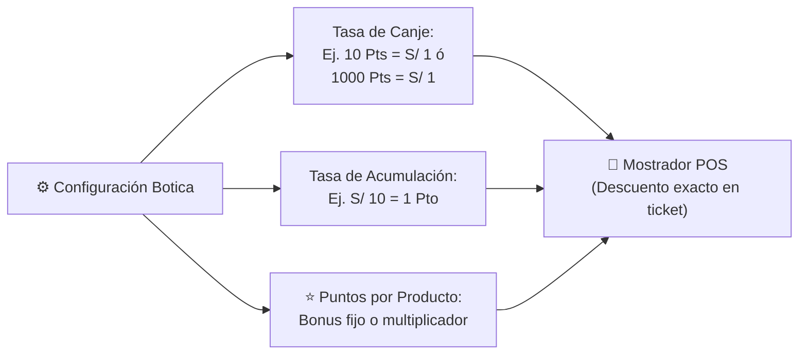

# 🏗️ PLAN MAESTRO DE CONSTRUCCIÓN FRONTEND v2.0 (VALETEC PHARMA)

Este plan rige la **arquitectura visual, diseño de pantallas completas (Full-Page SaaS Workspaces), cableado de eventos y modernización de interfaces** bajo las 10 reglas de oro permanentes.

---

## 📜 1. Las 10 Reglas de Oro Inviolables (Permanentes)

1. **Buenas prácticas:** Arquitectura limpia, semántica, modular, legible y mantenible.
2. **Cero push sin permiso:** Ningún commit ni push a GitHub sin indicación expresa del usuario.
3. **Backend 100% intocable:** El backend de Node.js/PostgreSQL se mantiene intacto (`server/` no se modifica).
4. **Mapeo perfecto de botones y eventos:** Cada botón, switch, atajo de teclado (`F-keys`, `ESC`) y drawer debe estar completamente cableado sin botones mudos o rotos.
5. **Detención ante dudas:** Cualquier error, ambigüedad o decisión detiene inmediatamente la ejecución para consultar al usuario.
6. **Pruebas controladas:** Solo se ejecutan pruebas cuando el usuario lo solicite explícitamente (al finalizar módulos completos).
7. **Paso a paso (Submódulo por submódulo):** Trabajo secuencial y minucioso, verificando cada entrega antes de pasar a la siguiente.
8. **Cero divagaciones:** Foco absoluto y estricto en la tarea inmediata.
9. **Autorización previa:** Se requiere la autorización explícita del usuario ("dale" o "procede") antes de modificar código en cada paso.
10. **Persistencia total:** Estas 10 reglas rigen permanentemente durante todo el proyecto.

---

## 🌟 2. Directriz de Diseño: Pantallas Completas (Full-Page SaaS Workspaces)

> [!IMPORTANT]
> **No más menús vacíos ni submenús flotantes superficiales:**
> Cada uno de los submódulos de la aplicación se diseña como una **pantalla operativa completa e integral** de alta densidad visual (SaaS 2026):
>
> 1. **Header de Control:** Título semántico, subtítulo operativo y grupo de botones de acción rápida (`.btn-primary`, `.btn-secondary`).
> 2. **Banda de KPIs en Tiempo Real:** 3 a 4 tarjetas analíticas superiores con métricas vivas y colores temáticos.
> 3. **Barra de Herramientas y Filtros:** Buscador predictivo reactivo, selectores de rango y pestañas segmentadas (`tabs`) con conteos en vivo.
> 4. **Área de Operación Principal:**
>    - Para catálogos/registros: Tablas SaaS de alta densidad con paginación, ordenamiento, badges de estado y acciones por fila.
>    - Para ventas: Workspace a doble panel ergonómico (Catálogo táctil/lector + Ticket de mostrador en tiempo real).
>    - Para arqueos: Matriz visual de billetes y monedas peruanas con cálculo instantáneo de sobrante/faltante.
> 5. **Paneles Laterales Deslizantes (`.drawer`):** Formularios de captura y edición de 560px a 720px que no descolocan al operador de la pantalla de trabajo.

---

## 🎁 3. Motor Configurable de Fidelización y Puntos (Ajustable por Botica)

Para adaptarse a cualquier modelo de negocio farmacéutico (desde cadenas hasta boticas independientes), el sistema de puntos se transforma en un **motor 100% dinámico y parametrizable**:



### Características del Motor de Fidelización:
1. **Regla de Canje Personalizable (Puntos a Dinero):**
   - Campo configurable por el administrador: `[ X ] Puntos = S/ 1.00 de descuento`.
   - Permite tanto esquemas tradicionales (`10 Pts = S/ 1.00`) como esquemas de alto volumen (`1,000 Pts = S/ 1.00` o `500 Pts = S/ 1.00`).
2. **Regla de Acumulación Personalizable (Compras a Puntos):**
   - Campo configurable: `S/ [ X ] en compras generan [ Y ] Puntos`.
3. **Puntos Bonificados por Producto Individual:**
   - En el Drawer de Producto (`#productDrawer`), se añade la sección de fidelización:
     - `[ Switch ] Otorgar Puntos Extra`: Permite definir puntos promocionales específicos para ese medicamento (ej. "+50 Pts extra" al llevar Colágeno o Vitamina C).
     - Visualización en el catálogo del POS para que el cajero incentive la compra ofreciendo los puntos de promoción.
4. **Niveles de Lealtad (Tiers) con Descuento Automático:**
   - Parámetros editables para umbrales de clientes **Bronce**, **Plata** y **Oro** con sus respectivos descuentos automáticos.

---

## 🗺️ 4. Mapa Maestro de Navegación y Vistas Completas

```
┌────────────────────────────────────────────────────────────────────────────────────────────────┐
│ BARRA LATERAL (9 MÓDULOS)   │ PANTALLA COMPLETA DE TRABAJO (FULL-PAGE SAAS WORKSPACE)          │
├─────────────────────────────┼──────────────────────────────────────────────────────────────────┤
│ 📊 1. DASHBOARD             │ KPIs ejecutivos, gráficos de facturación, fármacos más vendidos.  │
│ ⚡ 2. VENTAS                │                                                                  │
│    ├── Mostrador POS        │ Workspace a 2 columnas (Catálogo + Ticket, F-keys, canje puntos) │
│    └── Comprobantes         │ Historial de ventas del turno, reimpresión 80mm, reenvío SUNAT.  │
│ 💵 3. CAJA                  │                                                                  │
│    ├── Arqueo               │ Matriz interactiva de monedas y billetes (Sobrante/Faltante).    │
│    ├── Apertura             │ Asignación de fondo inicial de cambio por turno y cajero.        │
│    ├── Gastos               │ Registro de egresos menores y caja chica con motivo y recibo.   │
│    └── Cierre Z             │ Balance final de jornada, acta fiscal y bloqueo de turno.        │
│ 👥 4. CLIENTES              │                                                                  │
│    ├── Directorio           │ Padrón DNI/RUC, drawer de alta, historial de compras de cliente. │
│    └── Motor de Puntos      │ Panel de configuración de reglas, tasas de canje y promociones. │
│ 📦 5. INVENTARIO            │                                                                  │
│    ├── Productos            │ Catálogo maestro con 3 presentaciones (Caja/Blíster/Unidad).     │
│    ├── Lotes FEFO           │ Semáforo preventivo de vencimiento y bloqueo de lotes críticos.  │
│    ├── Kardex               │ Trazabilidad física de entradas, salidas y mermas por ítem.      │
│    ├── Categorías           │ Gestión de familias terapéuticas y laboratorios fabricantes.    │
│    └── Cuadre Stock         │ Módulo de auditoría física, escaneo y ajuste de diferencias.     │
│ 🚚 6. COMPRAS               │                                                                  │
│    ├── Ingresos Droguería   │ Registro guiado de factura/guía con costos y fechas de lotes.    │
│    ├── Proveedores          │ Directorio de droguerías, RUC, condiciones de crédito y plazos. │
│    └── Canjes / Mermas      │ Registro de medicamentos por vencer para devolución a proveedor. │
│ 📋 7. DIGEMID               │                                                                  │
│    ├── Recetas Retenidas    │ Libro oficial foliado de psicotrópicos con CMP y diagnóstico.    │
│    ├── Bóveda               │ Custodia bajo llave de estupefacientes y control de frascos.     │
│    └── Balances Sanitarios  │ Generación del informe oficial para inspectores de salud.        │
│ 📈 8. REPORTES              │                                                                  │
│    ├── Contador             │ Exportación mensual de ventas y compras (Excel/PDF con IGV).     │
│    └── Reposición           │ Sugerido automático de compras exportable para enviar a WhatsApp │
│ ⚙️ 9. AJUSTES               │                                                                  │
│    ├── Botica               │ RUC, Razón Social, logo, dirección, teléfono y director técnico. │
│    ├── Facturación SUNAT    │ Certificado digital, credenciales SOL y series de comprobantes.  │
│    ├── Personal & Roles     │ Usuarios, permisos estrictos (admin, qf, tech, cashier).         │
│    └── Backups              │ Exportación y respaldo de la base de datos PostgreSQL.          │
└────────────────────────────────────────────────────────────────────────────────────────────────┘
```

---

## 🧱 5. Cronograma de Construcción Secuencial (Submódulo por Submódulo)

### ✅ ETAPAS COMPLETADAS Y SINCRONIZADAS EN GITHUB:
* **ETAPA 0:** Cimientos, sistema de 3 botones, sistema de drawers y navegación lateral.
* **ETAPA 1:** Módulo de Inventario (5 submódulos probados y verificados).
* **ETAPA 2:** Módulo de Clientes (Directorio DNI/RUC y fidelización base probados con 22/22 PASS).

---

### 🚀 ETAPA 2.1: AMPLIACIÓN MOTOR CONFIGURABLE DE PUNTOS
* **Objetivo:** Incorporar las dos mejoras solicitadas por el usuario:
  1. **Vista de Configuración del Club de Puntos:**
     - Pantalla con inputs para tasa de canje: `[ X ] Puntos = S/ [ Y ]` (ej. 1000 pts = 1 sol).
     - Tasa de acumulación: `S/ [ X ] gastados = [ Y ] Puntos ganados`.
     - Porcentaje máximo de descuento aplicable por ticket.
  2. **Configuración de Puntos por Producto en Inventario:**
     - Campo en `#productDrawer` para asignar puntos bonificados fijos por medicamento.
     - Etiqueta de puntos de bonificación visible en el catálogo de productos.

---

### 🛒 ETAPA 3: MÓDULO DE VENTAS (PANTALLAS COMPLETAS)

#### Submódulo 1: Mostrador POS Rápido
* **Objetivo:** Pantalla completa ergonómica a 2 columnas para atención de alta velocidad.
* **Panel Catálogo (Izquierda):**
  - Buscador omnicanal reactivo con foco automático (`[F2]`).
  - Tarjetas visuales de productos con stock en vivo y badge de puntos promocionales.
  - Filtro rápido por categorías farmacéuticas (Analgésicos, Antibióticos, etc.).
* **Panel Ticket & Carrito (Derecha):**
  - Autocomplete de paciente con saldo de puntos y nivel de lealtad.
  - Partidas con stepper (`+`/`-`) y selector de fracción activa (`Caja`, `Blíster`, `Unidad`).
  - Validación sanitaria DIGEMID obligatoria (bloqueo y solicitud de CMP si es Lista IV).
  - Caja de canje de puntos con cálculo en tiempo real según la regla configurada.
  - Atajos: `F2` Buscar, `F4` Cliente, `F12` Cobrar.

#### Submódulo 2: Comprobantes & Turno
* **Objetivo:** Pantalla completa con el historial de ventas del turno actual.
* **Componentes:**
  - 3 KPIs: Total Facturado en Turno, Boletas Emitidas, Facturas Emitidas.
  - Tabla de comprobantes con estado SUNAT (Aceptado, Rechazado, Pendiente).
  - Drawer de detalle de venta con reimpresión en formato ticket 80mm.
  - Botón de anulación con nota de crédito (solo roles autorizados).

---

### 💵 ETAPA 4: MÓDULO DE CAJA (PANTALLAS COMPLETAS)
* **Submódulo 1: Apertura de Caja:** Pantalla con asignación de fondo inicial en efectivo y selección de turno.
* **Submódulo 2: Arqueo Físico:** Matriz visual e interactiva de billetes (S/ 200, 100, 50, 20, 10) y monedas (S/ 5, 2, 1, 0.50, 0.20, 0.10) con balance automático contra el sistema.
* **Submódulo 3: Gastos / Caja Chica:** Pantalla para salidas de dinero menores con motivo, comprobante y autorización.
* **Submódulo 4: Cierre Z:** Pantalla completa de liquidación con reporte final de medios de pago (Efectivo, Yape, Plin, Tarjeta) e impresión de acta.

---

### 🚚 ETAPA 5: MÓDULO DE COMPRAS & DROGUERÍAS
* **Submódulo 1: Ingreso de Mercadería:** Flujo completo de recepción de factura comercial con costos, lotes, fechas de vencimiento y actualización automática del costo promedio.
* **Submódulo 2: Proveedores:** Directorio maestro de droguerías y distribuidoras farmacéuticas con RUC y condiciones.
* **Submódulo 3: Canjes y Devoluciones:** Registro de productos próximos a vencer o deteriorados para retiro y nota de crédito con la droguería.

---

### 📋 ETAPA 6: MÓDULO DIGEMID (CONTROL SANITARIO)
* **Submódulo 1: Libro de Recetas Retenidas:** Registro oficial foliado de psicotrópicos y estupefacientes con número de receta, médico prescriptor, CMP y diagnóstico.
* **Submódulo 2: Bóveda / Custodia:** Control de stock físico restringido con acceso restringido bajo supervisión del Químico Farmacéutico.
* **Submódulo 3: Balances Sanitarios:** Generación automática de balances trimestrales exigidos por DIGEMID.

---

### 📈 ETAPA 7: MÓDULO DE REPORTES & GERENCIA
* **Submódulo 1: Reporte Contable:** Exportación mensual en Excel y PDF con cálculo de Base Imponible, IGV y ventas por tipo de comprobante.
* **Submódulo 2: Sugerido de Reposición:** Algoritmo que calcula qué productos están cerca del stock mínimo y genera un mensaje con formato para enviar por WhatsApp al proveedor.

---

### ⚙️ ETAPA 8: MÓDULO DE AJUSTES & CONFIGURACIÓN
* **Submódulo 1: Datos de la Botica:** Nombre comercial, RUC, logo, dirección, resolución de funcionamiento y Químico Regente.
* **Submódulo 2: SUNAT & Facturación:** Carga de certificado digital (.pfx), credenciales secundarias SOL y configuración de series.
* **Submódulo 3: Personal & Roles:** Asignación estricta de credenciales y permisos por rol.
* **Submódulo 4: Copias de Seguridad:** Respaldo y descarga de la base de datos con un clic.

---

### 📊 ETAPA 9: DASHBOARD EJECUTIVO
* **Integración Final:** Pantalla de mando central con gráficos de facturación diaria/mensual, ticket promedio, medicamentos con mayor margen y alertas de lotes por vencer.

---

## 🚦 6. Protocolo de Aprobación por Submódulo

Cada submódulo se ejecuta cumpliendo este ciclo:
1. **Propuesta visual y funcional de la Pantalla Completa.**
2. **Autorización del usuario ("dale" o "procede").**
3. **Maquetación, cableado de botones y sincronización con backend.**
4. **Verificación y pase al siguiente paso.**
