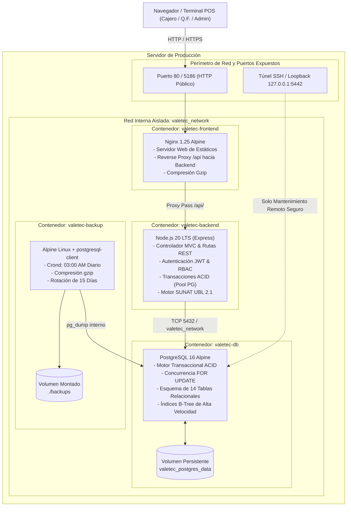
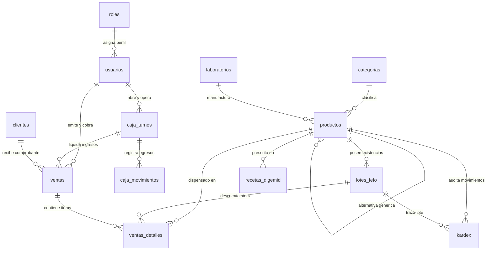

# VALETEC PHARMA SUITE v2.0 - DOCUMENTACIÓN TÉCNICA
**Módulo:** Especificación de Arquitectura, Modelo Relacional y Matriz de API REST  
**Entorno:** Producción Docker / PostgreSQL 16 ACID / Node.js 20 Express / Nginx Alpine  
**Normativa de Cumplimiento:** DIGEMID (R.M. 554-2022/MINSA) & SUNAT UBL 2.1  

---

## 1. Arquitectura del Sistema

VALETEC PHARMA SUITE opera bajo una arquitectura de micro-servicios desacoplados y empaquetados en contenedores Docker inmutables, orquestados mediante Docker Compose sobre una red interna virtualizada (`valetec_network`).

### 1.1 Diagrama de Arquitectura Física y de Red



### 1.2 Flujo de Datos y Capas MVC

El backend implementa un patrón MVC desacoplado con aislamiento estricto de responsabilidades:

1. **Capa de Transporte y Seguridad (`middlewares/`):**
   - `auth.middleware.js`: Extrae y verifica tokens JWT Bearer criptográficamente firmados con `HMAC-SHA256`.
   - `role.middleware.js`: Valida el control de acceso basado en roles (`RBAC`) antes de alcanzar la capa de controladores.
   - `error.middleware.js`: Atrapa excepciones de forma centralizada sin filtrar stack traces a producción.
2. **Capa de Controladores (`controllers/`):**
   - Recibe la solicitud HTTP, sanitiza y valida los parámetros de entrada (`payload`), orquesta las llamadas a modelos y responde con contratos JSON estandarizados `{ success, data, message, statusCode }`.
3. **Capa de Modelos y Acceso a Datos (`models/` & `db/`):**
   - Abstracción relacional con `pg.Pool`. Ejecuta consultas parametrizadas `$1, $2, ...` (inmune a inyecciones SQL) y transacciones atómicas con `BEGIN`, `COMMIT` y `ROLLBACK`.
   - Control de concurrencia pesimista con bloqueo de filas mediante `SELECT ... FOR UPDATE` para evitar condiciones de carrera en ventas simultáneas y salidas de almacén.

---

## 2. Diccionario de Datos del Esquema Relacional (14 Tablas)

El motor de persistencia utiliza **PostgreSQL 16**. A continuación se detalla la estructura canónica de las 14 tablas que conforman el sistema:

### 2.1 Tabla: `roles`
Catálogo de perfiles y niveles de autorización dentro de la farmacia.
* **Llave Primaria:** `id` (SERIAL)

| Columna | Tipo de Dato | Nulo | Por Defecto | Restricciones / Descripción |
| :--- | :--- | :---: | :--- | :--- |
| `id` | `SERIAL` | No | Auto | Llave primaria del rol |
| `name` | `VARCHAR(50)` | No | - | Identificador único (`admin`, `qf`, `tech`, `cashier`) |
| `label` | `VARCHAR(100)` | No | - | Nombre visible del cargo en la interfaz |
| `description` | `TEXT` | Sí | `NULL` | Alcance y atribuciones operativas del rol |
| `created_at` | `TIMESTAMPTZ` | Sí | `CURRENT_TIMESTAMP` | Marca temporal de creación |

---

### 2.2 Tabla: `usuarios`
Personal operativo, técnico y administrativo con credenciales de acceso.
* **Llave Primaria:** `id` (SERIAL)
* **Llaves Foráneas:** `role_id` $\rightarrow$ `roles(id)` (`ON UPDATE CASCADE ON DELETE RESTRICT`)

| Columna | Tipo de Dato | Nulo | Por Defecto | Restricciones / Descripción |
| :--- | :--- | :---: | :--- | :--- |
| `id` | `SERIAL` | No | Auto | Llave primaria |
| `role_id` | `INTEGER` | No | - | FK a roles |
| `name` | `VARCHAR(150)` | No | - | Nombre y apellido del colaborador |
| `email` | `VARCHAR(150)` | No | - | Correo corporativo (Índice Único) |
| `password_hash` | `VARCHAR(255)` | No | - | Hash criptográfico generado con bcrypt (10 rondas de salting) |
| `terminal` | `VARCHAR(50)` | Sí | `'Terminal 01'` | Terminal de trabajo asignado por defecto |
| `shift` | `VARCHAR(100)` | Sí | `'Mañana (08:00 - 16:00)'` | Horario de turno habitual |
| `permissions` | `TEXT` | Sí | `NULL` | Descriptores de atribuciones |
| `target` | `VARCHAR(100)` | Sí | `NULL` | Meta de dispensación o ventas mensual |
| `status` | `VARCHAR(20)` | No | `'active'` | `CHECK(status IN ('active', 'inactive', 'pending'))` |
| `created_at` | `TIMESTAMPTZ` | Sí | `CURRENT_TIMESTAMP` | Fecha y hora de alta en la plataforma |

---

### 2.3 Tabla: `categorias`
Clasificación terapéutica y comercial de productos farmacéuticos.
* **Llave Primaria:** `id` (SERIAL)

| Columna | Tipo de Dato | Nulo | Por Defecto | Restricciones / Descripción |
| :--- | :--- | :---: | :--- | :--- |
| `id` | `SERIAL` | No | Auto | Identificador primario |
| `slug` | `VARCHAR(50)` | No | - | Identificador semántico URL-friendly (Único) |
| `name` | `VARCHAR(100)` | No | - | Nombre de la categoría (ej. Analgésicos, Antibióticos) |
| `icon` | `VARCHAR(50)` | Sí | `NULL` | Identificador de icono CSS o SVG |
| `created_at` | `TIMESTAMPTZ` | Sí | `CURRENT_TIMESTAMP` | Marca temporal de registro |

---

### 2.4 Tabla: `productos`
Maestro de medicamentos, insumos médicos y artículos de parafarmacia.
* **Llave Primaria:** `id` (SERIAL)
* **Llaves Foráneas:** 
  * `category_id` $\rightarrow$ `categorias(id)` (`ON UPDATE CASCADE ON DELETE RESTRICT`)
  * `generic_alt_id` $\rightarrow$ `productos(id)` (`ON UPDATE CASCADE ON DELETE SET NULL`)

| Columna | Tipo de Dato | Nulo | Por Defecto | Restricciones / Descripción |
| :--- | :--- | :---: | :--- | :--- |
| `id` | `SERIAL` | No | Auto | Identificador primario |
| `barcode` | `VARCHAR(50)` | No | - | Código de barras EAN-13 / GS1 (Único e Indexado) |
| `name` | `VARCHAR(200)` | No | - | Nombre comercial del medicamento |
| `generic_dci` | `VARCHAR(200)` | No | - | Denominación Común Internacional (DCI) / Principio activo |
| `laboratory` | `VARCHAR(150)` | No | - | Laboratorio titular del registro |
| `category_id` | `INTEGER` | No | - | Categoría terapéutica vinculada |
| `location` | `VARCHAR(100)` | No | - | Ubicación física en botica (ej. Anaquel B-04) |
| `box_price` | `NUMERIC(10,2)` | No | - | Precio de venta al público por Caja (`CHECK >= 0`) |
| `blister_price` | `NUMERIC(10,2)` | No | - | Precio de venta por Blíster (`CHECK >= 0`) |
| `unit_price` | `NUMERIC(10,2)` | No | - | Precio por Pastilla/Unidad fraccionada (`CHECK >= 0`) |
| `units_per_box` | `INTEGER` | No | `100` | Unidades fraccionarias contenidas en 1 caja (`CHECK > 0`) |
| `units_per_blister`| `INTEGER` | No | `10` | Unidades contenidas en 1 blíster (`CHECK > 0`) |
| `prescription_type`| `VARCHAR(20)` | No | `'free'` | Condición de venta: `CHECK('free', 'required', 'retained')` |
| `generic_alt_id`| `INTEGER` | Sí | `NULL` | ID del medicamento genérico alternativo sugerido |
| `generic_saving_percent` | `INTEGER` | Sí | `0` | Porcentaje estimado de ahorro para el cliente |
| `sanitary_registry`| `VARCHAR(100)` | Sí | `NULL` | Registro Sanitario DIGEMID (ej. NG-12345) |
| `status` | `VARCHAR(20)` | No | `'active'` | `CHECK(status IN ('active', 'inactive'))` |
| `created_at` | `TIMESTAMPTZ` | Sí | `CURRENT_TIMESTAMP` | Fecha de creación del registro |

---

### 2.5 Tabla: `lotes_fefo`
Inventario físico segmentado por número de lote y fecha de expiración para cumplimiento estricto de rotación FEFO (*First Expire, First Out*).
* **Llave Primaria:** `id` (SERIAL)
* **Llaves Foráneas:** `product_id` $\rightarrow$ `productos(id)` (`ON UPDATE CASCADE ON DELETE CASCADE`)

| Columna | Tipo de Dato | Nulo | Por Defecto | Restricciones / Descripción |
| :--- | :--- | :---: | :--- | :--- |
| `id` | `SERIAL` | No | Auto | Identificador de lote |
| `product_id` | `INTEGER` | No | - | Medicamento vinculado |
| `lot_number` | `VARCHAR(50)` | No | - | Código alfanumérico del lote del fabricante |
| `expire_date` | `DATE` | No | - | Fecha exacta de vencimiento (Indexado) |
| `stock_boxes` | `INTEGER` | No | `0` | Cajas selladas disponibles (`CHECK >= 0`) |
| `stock_blisters`| `INTEGER` | No | `0` | Blísteres sueltos disponibles (`CHECK >= 0`) |
| `stock_units` | `INTEGER` | No | `0` | Pastillas/unidades fraccionadas sueltas (`CHECK >= 0`) |
| `fefo_status` | `VARCHAR(20)` | No | `'good'` | Semáforo sanitario: `CHECK('good', 'warning', 'expired')` |
| `created_at` | `TIMESTAMPTZ` | Sí | `CURRENT_TIMESTAMP` | Fecha de recepción en almacén |
| `updated_at` | `TIMESTAMPTZ` | Sí | `CURRENT_TIMESTAMP` | Última actualización de existencias |

---

### 2.6 Tabla: `recetas_digemid`
Libro oficial de control de recetas médicas para fármacos psicotrópicos, estupefacientes y medicamentos de prescripción retenida.
* **Llave Primaria:** `id` (SERIAL)
* **Llaves Foráneas:** `product_id` $\rightarrow$ `productos(id)` (`ON UPDATE CASCADE ON DELETE SET NULL`)

| Columna | Tipo de Dato | Nulo | Por Defecto | Restricciones / Descripción |
| :--- | :--- | :---: | :--- | :--- |
| `id` | `SERIAL` | No | Auto | Identificador primario |
| `folio` | `VARCHAR(50)` | No | - | Número oficial de folio correlativo (Único e Indexado) |
| `patient_name` | `VARCHAR(150)` | No | - | Nombre completo del paciente |
| `patient_dni` | `VARCHAR(20)` | No | - | Documento de identidad del paciente |
| `doctor_name` | `VARCHAR(150)` | No | - | Nombre del médico prescriptor |
| `doctor_cmp` | `VARCHAR(50)` | No | - | Número de colegiatura médica (CMP / COP) |
| `product_id` | `INTEGER` | Sí | `NULL` | Medicamento controlado dispensado |
| `medication_details`| `TEXT` | No | - | Posología, concentración y dosificación prescrita |
| `date_issued` | `VARCHAR(20)` | No | - | Fecha de emisión de la receta médica |
| `status` | `VARCHAR(20)` | No | `'retained'` | `CHECK(status IN ('retained', 'approved', 'dispensed'))` |
| `notes` | `TEXT` | Sí | `NULL` | Observaciones técnicas de la Química Farmacéutica |
| `created_at` | `TIMESTAMPTZ` | Sí | `CURRENT_TIMESTAMP` | Fecha de retención en farmacia |

---

### 2.7 Tabla: `caja_turnos`
Control de sesiones de venta, gavetas de efectivo y arqueo oficial de Cierre Z.
* **Llave Primaria:** `id` (SERIAL)
* **Llaves Foráneas:** `user_id` $\rightarrow$ `usuarios(id)` (`ON UPDATE CASCADE ON DELETE RESTRICT`)

| Columna | Tipo de Dato | Nulo | Por Defecto | Restricciones / Descripción |
| :--- | :--- | :---: | :--- | :--- |
| `id` | `SERIAL` | No | Auto | Identificador de turno |
| `user_id` | `INTEGER` | No | - | Cajero o colaborador responsable del turno |
| `terminal` | `VARCHAR(50)` | No | `'Caja 01'` | Terminal POS física |
| `opening_balance` | `NUMERIC(10,2)` | No | `350.00` | Saldo inicial asignado para dar vuelto |
| `cash_sales` | `NUMERIC(10,2)` | No | `0.00` | Acumulado de ventas cobradas en efectivo |
| `digital_sales` | `NUMERIC(10,2)` | No | `0.00` | Acumulado de ventas cobradas con Yape, Plin o Tarjeta |
| `expenses` | `NUMERIC(10,2)` | No | `0.00` | Total de egresos menores de caja chica |
| `expected_balance`| `NUMERIC(10,2)` | No | `350.00` | Saldo teórico que debe haber en gaveta |
| `counted_balance` | `NUMERIC(10,2)` | Sí | `0.00` | Monto físico declarado en el arqueo final |
| `difference` | `NUMERIC(10,2)` | Sí | `0.00` | Descuadre (`counted_balance - expected_balance`) |
| `status` | `VARCHAR(20)` | No | `'open'` | Estado del turno: `CHECK('open', 'closed_z')` |
| `opened_at` | `TIMESTAMPTZ` | Sí | `CURRENT_TIMESTAMP` | Apertura de turno |
| `closed_at` | `TIMESTAMPTZ` | Sí | `NULL` | Momento exacto de emisión del Cierre Z |

---

### 2.8 Tabla: `caja_movimientos`
Bitácora de movimientos menores de efectivo durante el turno activo.
* **Llave Primaria:** `id` (SERIAL)
* **Llaves Foráneas:** `turno_id` $\rightarrow$ `caja_turnos(id)` (`ON UPDATE CASCADE ON DELETE CASCADE`)

| Columna | Tipo de Dato | Nulo | Por Defecto | Restricciones / Descripción |
| :--- | :--- | :---: | :--- | :--- |
| `id` | `SERIAL` | No | Auto | Identificador del movimiento |
| `turno_id` | `INTEGER` | No | - | Turno de caja afectado |
| `type` | `VARCHAR(20)` | No | - | Tipo de operación: `CHECK('egreso', 'ingreso')` |
| `amount` | `NUMERIC(10,2)` | No | - | Importe del movimiento (`CHECK > 0`) |
| `concept` | `TEXT` | No | - | Justificación (ej. Pago de artículos de limpieza) |
| `responsible` | `VARCHAR(100)` | No | - | Nombre de quien autorizó o ejecutó el gasto |
| `created_at` | `TIMESTAMPTZ` | Sí | `CURRENT_TIMESTAMP` | Fecha y hora exacta del egreso/ingreso |

---

### 2.9 Tabla: `ventas`
Cabecera fiscal de comprobantes de pago emitidos en mostrador.
* **Llave Primaria:** `id` (SERIAL)
* **Llaves Foráneas:**
  * `user_id` $\rightarrow$ `usuarios(id)` (`ON UPDATE CASCADE ON DELETE RESTRICT`)
  * `turno_id` $\rightarrow$ `caja_turnos(id)` (`ON UPDATE CASCADE ON DELETE SET NULL`)

| Columna | Tipo de Dato | Nulo | Por Defecto | Restricciones / Descripción |
| :--- | :--- | :---: | :--- | :--- |
| `id` | `SERIAL` | No | Auto | Identificador primario de venta |
| `invoice_series` | `VARCHAR(10)` | No | - | Serie fiscal (ej. `B001`, `F001`, `TCK1`) |
| `invoice_number` | `INTEGER` | No | - | Número correlativo del comprobante |
| `invoice_type` | `VARCHAR(20)` | No | - | Tipo de comprobante: `CHECK('boleta', 'factura', 'ticket')` |
| `user_id` | `INTEGER` | No | - | Vendedor / Cajero que atendió |
| `turno_id` | `INTEGER` | Sí | `NULL` | Turno de caja en el que se liquidó la venta |
| `customer_doc` | `VARCHAR(20)` | Sí | `NULL` | DNI o RUC del cliente (Indexado) |
| `customer_name` | `VARCHAR(150)` | Sí | `NULL` | Razón social o nombres del cliente |
| `payment_method` | `VARCHAR(20)` | No | - | Canal de pago: `CHECK('cash', 'yape', 'card')` |
| `subtotal` | `NUMERIC(10,2)` | No | - | Base imponible sin tributos (`CHECK >= 0`) |
| `igv` | `NUMERIC(10,2)` | No | - | Impuesto General a las Ventas (18%) (`CHECK >= 0`) |
| `total` | `NUMERIC(10,2)` | No | - | Importe total cobrado al cliente (`CHECK >= 0`) |
| `amount_paid` | `NUMERIC(10,2)` | No | - | Efectivo o importe recibido (`CHECK >= 0`) |
| `change_given` | `NUMERIC(10,2)` | No | `0.00` | Vuelto entregado al usuario (`CHECK >= 0`) |
| `payment_reference`| `VARCHAR(100)`| Sí | `NULL` | Código de operación bancaria o Yape |
| `status` | `VARCHAR(20)` | No | `'completed'` | Estado de la venta: `CHECK('completed', 'cancelled')` |
| `sunat_status` | `VARCHAR(30)` | No | `'pending'` | Estado en SUNAT: `pending`, `accepted`, `rejected` |
| `sunat_response` | `TEXT` | Sí | `NULL` | Mensaje CDR o código de error devuelto por SUNAT |
| `sunat_ticket` | `VARCHAR(100)` | Sí | `NULL` | Número de ticket de recepción en cola fiscal |
| `sunat_sent_at` | `TIMESTAMPTZ` | Sí | `NULL` | Marca de tiempo de transmisión electrónica |
| `hash_cpe` | `TEXT` | Sí | `NULL` | Hash SHA-1 de la firma digital del XML |
| `xml_ubl` | `TEXT` | Sí | `NULL` | Estructura electrónica UBL 2.1 generada |
| `created_at` | `TIMESTAMPTZ` | Sí | `CURRENT_TIMESTAMP` | Fecha y hora de emisión (Indexado) |

---

### 2.10 Tabla: `ventas_detalles`
Líneas de producto de cada comprobante emitido, con especificación de lote y nivel de fraccionamiento.
* **Llave Primaria:** `id` (SERIAL)
* **Llaves Foráneas:**
  * `sale_id` $\rightarrow$ `ventas(id)` (`ON UPDATE CASCADE ON DELETE CASCADE`)
  * `product_id` $\rightarrow$ `productos(id)` (`ON UPDATE CASCADE ON DELETE RESTRICT`)
  * `lot_id` $\rightarrow$ `lotes_fefo(id)` (`ON UPDATE CASCADE ON DELETE SET NULL`)

| Columna | Tipo de Dato | Nulo | Por Defecto | Restricciones / Descripción |
| :--- | :--- | :---: | :--- | :--- |
| `id` | `SERIAL` | No | Auto | Identificador del detalle |
| `sale_id` | `INTEGER` | No | - | Venta asociada |
| `product_id` | `INTEGER` | No | - | Medicamento dispensado |
| `lot_id` | `INTEGER` | Sí | `NULL` | Lote físico del cual se descontó el stock |
| `fraction_type` | `VARCHAR(20)` | No | - | Fracción vendida: `CHECK('box', 'blister', 'unit')` |
| `quantity` | `INTEGER` | No | - | Cantidad dispensada de dicha fracción (`CHECK > 0`) |
| `unit_price` | `NUMERIC(10,2)` | No | - | Precio unitario aplicado a la fracción (`CHECK >= 0`) |
| `subtotal` | `NUMERIC(10,2)` | No | - | Importe de la línea (`CHECK >= 0`) |

---

### 2.11 Tabla: `clientes`
Padrón de compradores frecuentes y registro de puntos de fidelización.
* **Llave Primaria:** `id` (SERIAL)

| Columna | Tipo de Dato | Nulo | Por Defecto | Restricciones / Descripción |
| :--- | :--- | :---: | :--- | :--- |
| `id` | `SERIAL` | No | Auto | Identificador primario |
| `document_type` | `VARCHAR(10)` | No | - | Tipo de documento: `CHECK('DNI', 'RUC', 'CE', 'PASAPORTE')` |
| `document_number`| `VARCHAR(20)` | No | - | Número de documento (Único e Indexado) |
| `full_name` | `VARCHAR(200)` | No | - | Nombre completo o razón social (Indexado) |
| `address` | `TEXT` | Sí | `NULL` | Dirección fiscal / domiciliaria |
| `phone` | `VARCHAR(50)` | Sí | `NULL` | Teléfono o celular de contacto |
| `email` | `VARCHAR(150)` | Sí | `NULL` | Correo electrónico para facturación |
| `points_balance` | `INTEGER` | No | `0` | Puntos acumulados canjeables (`CHECK >= 0`) |
| `created_at` | `TIMESTAMPTZ` | Sí | `CURRENT_TIMESTAMP` | Fecha de afiliación |
| `updated_at` | `TIMESTAMPTZ` | Sí | `CURRENT_TIMESTAMP` | Última actualización de datos |

---

### 2.12 Tabla: `laboratorios`
Fabricantes y droguerías farmacéuticas autorizadas.
* **Llave Primaria:** `id` (SERIAL)

| Columna | Tipo de Dato | Nulo | Por Defecto | Restricciones / Descripción |
| :--- | :--- | :---: | :--- | :--- |
| `id` | `SERIAL` | No | Auto | Identificador del laboratorio |
| `name` | `VARCHAR(150)` | No | - | Razón social del laboratorio (Único) |
| `country` | `VARCHAR(100)` | Sí | `'Perú'` | País de origen de la manufactura |
| `contact` | `TEXT` | Sí | `NULL` | Teléfonos, correos o contacto de ventas |
| `created_at` | `TIMESTAMPTZ` | Sí | `CURRENT_TIMESTAMP` | Fecha de registro |

---

### 2.13 Tabla: `configuraciones`
Parámetros institucionales, fiscales y sanitarios de la botica (Fila única `id = 1`).
* **Llave Primaria:** `id` (SERIAL)

| Columna | Tipo de Dato | Nulo | Por Defecto | Restricciones / Descripción |
| :--- | :--- | :---: | :--- | :--- |
| `id` | `SERIAL` | No | Auto | Identificador de configuración |
| `company_name` | `VARCHAR(200)` | No | - | Razón Social inscrita en SUNAT |
| `commercial_name`| `VARCHAR(200)`| Sí | `NULL` | Nombre comercial de la botica |
| `ruc` | `VARCHAR(20)` | No | - | Registro Único de Contribuyentes (11 dígitos) |
| `address` | `TEXT` | Sí | `NULL` | Dirección del establecimiento farmacéutico |
| `phone` | `VARCHAR(50)` | Sí | `NULL` | Teléfono de atención al cliente |
| `email` | `VARCHAR(150)` | Sí | `NULL` | Correo institucional |
| `currency_symbol`| `VARCHAR(10)` | Sí | `'S/'` | Símbolo monetario |
| `currency_code` | `VARCHAR(10)` | Sí | `'PEN'` | Código ISO 4217 de la moneda |
| `igv_percent` | `NUMERIC(5,2)` | Sí | `18.00` | Tasa del IGV |
| `sanitary_license`| `VARCHAR(100)`| Sí | `NULL` | Licencia Sanitaria oficial DIGEMID |
| `technical_director`| `VARCHAR(150)`| Sí | `NULL` | Nombre y Colegiatura de la Directora Técnica (Q.F.) |
| `invoice_footer_text`| `TEXT` | Sí | `NULL` | Mensaje de pie en tickets y comprobantes |
| `created_at` | `TIMESTAMPTZ` | Sí | `CURRENT_TIMESTAMP` | Fecha de creación |
| `updated_at` | `TIMESTAMPTZ` | Sí | `CURRENT_TIMESTAMP` | Fecha de última modificación |

---

### 2.14 Tabla: `kardex`
Libro mayor de movimientos físicos de almacén para auditoría de trazabilidad estricta.
* **Llave Primaria:** `id` (SERIAL)
* **Llaves Foráneas:**
  * `product_id` $\rightarrow$ `productos(id)` (`ON UPDATE CASCADE ON DELETE RESTRICT`)
  * `lot_id` $\rightarrow$ `lotes_fefo(id)` (`ON UPDATE CASCADE ON DELETE SET NULL`)

| Columna | Tipo de Dato | Nulo | Por Defecto | Restricciones / Descripción |
| :--- | :--- | :---: | :--- | :--- |
| `id` | `SERIAL` | No | Auto | Identificador de movimiento Kardex |
| `product_id` | `INTEGER` | No | - | Medicamento auditado (Indexado) |
| `lot_id` | `INTEGER` | Sí | `NULL` | Lote físico específico (Indexado) |
| `movement_type` | `VARCHAR(50)` | No | - | Tipo: `VENTA`, `COMPRA`, `MERMA_VENCIMIENTO`, `AJUSTE_ROTURA`, `ANULACION_VENTA` |
| `reference_type`| `VARCHAR(50)` | Sí | `NULL` | Tipo de documento soporte (`VENTA`, `RECETA`, `GUIA_REMISION`, `AJUSTE`) |
| `reference_id` | `VARCHAR(50)` | Sí | `NULL` | Número de serie/correlativo del documento soporte |
| `quantity` | `INTEGER` | No | - | Cantidad de unidades físicas movilizadas |
| `unit_type` | `VARCHAR(20)` | Sí | `'unit'` | Unidad de medida (`box`, `blister`, `unit`) |
| `previous_stock`| `INTEGER` | No | `0` | Saldo físico antes de la operación |
| `new_stock` | `INTEGER` | No | `0` | Saldo físico resultante |
| `reason` | `TEXT` | Sí | `NULL` | Justificación técnica del ajuste o merma |
| `user_name` | `VARCHAR(150)` | Sí | `NULL` | Nombre y cargo del operador responsable |
| `created_at` | `TIMESTAMPTZ` | Sí | `CURRENT_TIMESTAMP` | Marca temporal inmutable del movimiento |

---

### 2.15 Diagrama Entidad-Relación (ERD)



---

## 3. Catálogo de API REST & Matriz de Permisos RBAC

Todos los endpoints (con excepción del inicio de sesión y el healthcheck público) exigen la cabecera HTTP:
```http
Authorization: Bearer <TOKEN_JWT_VALIDO>
```

### 3.1 Definición de Roles del Sistema
* **`admin` (Dueño / Gerente General):** Acceso total a finanzas, anulación de ventas, gestión de usuarios, auditoría, configuración institucional y backups.
* **`qf` (Química Farmacéutica / Directora Técnica):** Control de Regencia, libro de controlados DIGEMID, recepción de lotes FEFO, declaración de mermas y balances sanitarios.
* **`tech` (Técnico de Farmacia):** Atención en mostrador, consulta de inventario, dispensación asistida y registro de recetas.
* **`cashier` (Cajero de Turno):** Cobro en POS, emisión de comprobantes, apertura/cierre de su propia caja y registro de egresos menores.

---

### 3.2 Matriz de Endpoints y Permisos RBAC

| Método | Endpoint | Descripción | Admin | Q.F. | Tech | Cashier |
| :--- | :--- | :--- | :---: | :---: | :---: | :---: |
| `POST` | `/api/auth/login` | Autenticación y entrega de token JWT *(Público)* | ✅ | ✅ | ✅ | ✅ |
| `GET` | `/api/auth/me` | Consulta de perfil del usuario en sesión | ✅ | ✅ | ✅ | ✅ |
| `POST` | `/api/auth/logout` | Revocación y cierre de sesión | ✅ | ✅ | ✅ | ✅ |
| `GET` | `/api/health` | Diagnóstico de salud del servicio y de la BD | ✅ | ✅ | ✅ | ✅ |
| **Ventas & POS** | | | | | | |
| `POST` | `/api/sales` | Registro de venta atómica con bloqueo FEFO | ✅ | ❌ | ✅ | ✅ |
| `GET` | `/api/sales` | Historial paginado de ventas y comprobantes | ✅ | ✅ | ✅ | ✅ |
| `GET` | `/api/sales/:id` | Detalle completo de una venta y datos de ticket | ✅ | ✅ | ✅ | ✅ |
| `PATCH`| `/api/sales/:id/cancel` | Anulación de venta y restitución a Kardex | ✅ | ❌ | ❌ | ❌ |
| `GET` | `/api/sales/sunat/pending` | Lista de comprobantes en cola fiscal SUNAT | ✅ | ✅ | ❌ | ✅ |
| `POST` | `/api/sales/sunat/sync` | Envío manual en lote a SUNAT | ✅ | ✅ | ❌ | ❌ |
| `POST` | `/api/sales/:id/sunat/retry` | Reintentar comprobante individual en SUNAT | ✅ | ✅ | ❌ | ❌ |
| **Productos & Lotes** | | | | | | |
| `GET` | `/api/products` | Catálogo de productos y existencias | ✅ | ✅ | ✅ | ✅ |
| `GET` | `/api/products/:id` | Ficha técnica de producto | ✅ | ✅ | ✅ | ✅ |
| `POST` | `/api/products` | Alta de nuevo medicamento maestro | ✅ | ✅ | ❌ | ❌ |
| `PUT` | `/api/products/:id` | Edición de precios, datos y presentación | ✅ | ✅ | ❌ | ❌ |
| `PATCH`| `/api/products/:id/toggle` | Habilitar / Deshabilitar producto en catálogo | ✅ | ❌ | ❌ | ❌ |
| `GET` | `/api/products/lots/expiring` | Alerta de lotes próximos a vencer (< 90 días) | ✅ | ✅ | ❌ | ❌ |
| `POST` | `/api/products/receive` | Recepción de mercadería e ingreso de nuevo lote | ✅ | ✅ | ❌ | ❌ |
| `POST` | `/api/products/:id/lots` | Asignación directa de lote a producto | ✅ | ✅ | ❌ | ❌ |
| `POST` | `/api/products/adjust-stock` | Ajuste de inventario y declaración de mermas | ✅ | ✅ | ❌ | ❌ |
| **Control de Caja** | | | | | | |
| `GET` | `/api/cash/current` | Estado y balance en vivo del turno activo | ✅ | ❌ | ❌ | ✅ |
| `POST` | `/api/cash/open` | Apertura de nuevo turno con saldo inicial | ✅ | ❌ | ❌ | ✅ |
| `POST` | `/api/cash/movement` | Registro de gasto menor / egreso de caja chica | ✅ | ❌ | ❌ | ✅ |
| `POST` | `/api/cash/close-z` | Declaración de arqueo físico y emisión Cierre Z | ✅ | ❌ | ❌ | ✅ |
| `GET` | `/api/cash/history` | Historial de cierres Z y turnos anteriores | ✅ | ❌ | ❌ | ✅ |
| **Regencia DIGEMID** | | | | | | |
| `GET` | `/api/recipes` | Listado de recetas médicas foliadas | ✅ | ✅ | ❌ | ❌ |
| `POST` | `/api/recipes` | Foliar y retener nueva receta médica | ✅ | ✅ | ❌ | ❌ |
| `PATCH`| `/api/recipes/:folio/status`| Transición de receta (Retenida/Dispensada) | ✅ | ✅ | ❌ | ❌ |
| `GET` | `/api/recipes/balance` | Balance Sanitario consolidado de controlados | ✅ | ✅ | ❌ | ❌ |
| **Kardex & Reportes** | | | | | | |
| `GET` | `/api/reports/dashboard` | Métricas operativas consolidadas | ✅ | ❌ | ❌ | ❌ |
| `GET` | `/api/reports/kardex-summary` | Resumen de inventario valorizado | ✅ | ✅ | ❌ | ❌ |
| `GET` | `/api/reports/kardex/:productId` | Trazabilidad física detallada por producto | ✅ | ✅ | ❌ | ❌ |
| `GET` | `/api/dashboard/kpis` | Indicadores de margen, ticket promedio y metas | ✅ | ❌ | ❌ | ❌ |
| `GET` | `/api/dashboard/sales-chart` | Datos cronológicos de ventas para gráficos | ✅ | ❌ | ❌ | ❌ |
| `GET` | `/api/dashboard/top-products`| Ranking de productos de mayor rotación | ✅ | ❌ | ❌ | ❌ |
| **Padrón de Clientes** | | | | | | |
| `GET` | `/api/clients` | Padrón general de clientes | ✅ | ✅ | ✅ | ✅ |
| `GET` | `/api/clients/search` | Búsqueda por DNI, RUC o Nombre | ✅ | ✅ | ✅ | ✅ |
| `POST` | `/api/clients` | Registro de nuevo cliente con saldo de puntos | ✅ | ✅ | ✅ | ✅ |
| `PUT` | `/api/clients/:id` | Modificación de datos del cliente | ✅ | ✅ | ✅ | ✅ |
| **Categorías & Lab** | | | | | | |
| `GET` | `/api/categories` | Lista de familias y categorías | ✅ | ✅ | ✅ | ✅ |
| `POST` | `/api/categories` | Crear categoría | ✅ | ✅ | ❌ | ❌ |
| `PUT` | `/api/categories/:id` | Editar categoría | ✅ | ✅ | ❌ | ❌ |
| `DELETE`| `/api/categories/:id` | Eliminar categoría | ✅ | ❌ | ❌ | ❌ |
| `GET` | `/api/laboratories` | Lista de laboratorios | ✅ | ✅ | ✅ | ✅ |
| `POST` | `/api/laboratories` | Registrar laboratorio | ✅ | ✅ | ❌ | ❌ |
| `PUT` | `/api/laboratories/:id` | Editar datos de laboratorio | ✅ | ✅ | ❌ | ❌ |
| `DELETE`| `/api/laboratories/:id` | Eliminar laboratorio | ✅ | ❌ | ❌ | ❌ |
| **Administración & TI**| | | | | | |
| `GET` | `/api/users` | Listado y administración de personal | ✅ | ❌ | ❌ | ❌ |
| `GET` | `/api/settings` | Lectura de parámetros de la botica *(Público)* | ✅ | ✅ | ✅ | ✅ |
| `PUT` | `/api/settings` | Modificación de RUC, razón social y directores | ✅ | ❌ | ❌ | ❌ |
| `GET` | `/api/system/backup` | Descarga de respaldo `.sql` de base de datos | ✅ | ❌ | ❌ | ❌ |
| `POST` | `/api/webhooks/payment` | Recepción de pagos desde terminal POS físico | 🔐 Firma Criptográfica HMAC |

---

## 4. Estructura de Respuestas y Manejo de Errores

Todas las respuestas del API REST mantienen el contrato JSON uniforme:

### 4.1 Respuesta Exitosa (200 OK / 201 Created)
```json
{
  "success": true,
  "statusCode": 200,
  "message": "Operación completada exitosamente.",
  "data": { ... }
}
```

### 4.2 Respuesta de Error Controlado (400 / 401 / 403 / 404 / 409 / 500)
```json
{
  "success": false,
  "statusCode": 403,
  "error": "Acceso denegado: El rol 'Técnico de Mostrador' no tiene permisos para esta acción.",
  "requiredRoles": ["qf", "admin"]
}
```
