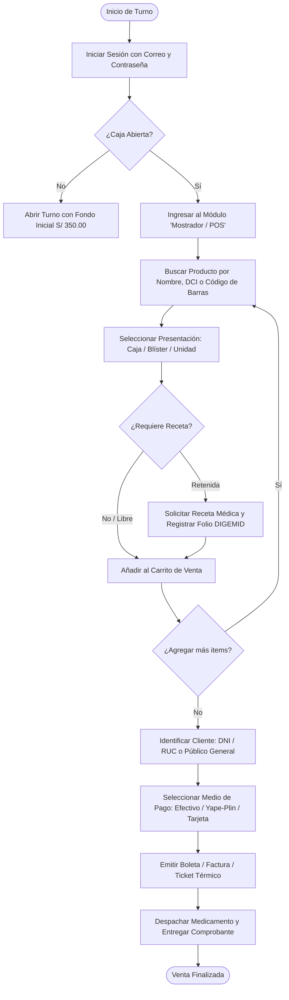

# VALETEC PHARMA SUITE v2.0 - MANUAL OPERATIVO & SOP
**Módulo:** Procedimientos Operativos Estandarizados (SOP / POE)  
**Destinatarios:** Personal de Mostrador, Técnicos en Farmacia, Almacén y Químico Farmacéutico (Regente)  
**Marco Normativo:** DIGEMID (R.M. 554-2022/MINSA & R.M. 132-2015/MINSA - Buenas Prácticas de Oficina Farmacéutica)  

---

## 1. SOP-01: Operación de Mostrador (Punto de Venta POS)

### 1.1 Objetivo
Estandarizar el proceso de dispensación y expendio de medicamentos y productos afines en el mostrador de atención al público, garantizando una atención ágil, sin errores de inventario y cumpliendo la normativa sanitaria.

### 1.2 Responsables
* Técnicos en Farmacia (`tech`)
* Cajeros de Turno (`cashier`)
* Químico Farmacéutico de Turno (`qf`)

---

### 1.3 Procedimiento de Venta Paso a Paso



#### Paso 1: Búsqueda del Medicamento
El operador dispone de 3 modalidades de búsqueda en el campo superior del POS:
1. **Lector de Código de Barras:** Pistolear el código impreso en la caja (búsqueda instantánea por código EAN-13).
2. **Nombre Comercial:** Escribir las primeras letras de la marca (ej. *Panadol Forte*, *Amoxicilina AC*).
3. **Principio Activo (DCI):** Buscar por denominación genérica internacional (ej. *Paracetamol*, *Ibuprofeno*, *Ciprofloxacino*).

#### Paso 2: Selección de Fraccionamiento
El sistema calcula automáticamente el stock y precio según la presentación seleccionada:
* **Caja:** Para compras de tratamiento completo o envase cerrado.
* **Blíster:** Venta por lámina o tableta metálica (precio calculado con descuento fraccional).
* **Unidad / Pastilla:** Venta fraccionada al detalle para pacientes con prescripciones de pocos días.
> **Regla de Negocio:** El sistema descuenta las pastillas o blísteres del lote más antiguo en almacén respetando el inventario físico global en unidades base.

#### Paso 3: Venta Asistida y Sugerencia de Genéricos
Cuando un cliente solicita un medicamento de marca costoso, el mostrador mostrará una tarjeta de alerta con el **Genérico Equivalente (DCI)**:
* Se indica el laboratorio fabricante y el porcentaje de ahorro (ej. *Ahorro de hasta 65%*).
* El técnico puede sugerir el genérico legalmente autorizado, fomentando la accesibilidad económica del paciente.

#### Paso 4: Identificación del Cliente
* **Público General:** Si el cliente no solicita comprobante con datos y la compra es menor a S/ 700.00, se puede usar el cliente genérico predeterminado.
* **Boleta con DNI:** Digitar el DNI (8 dígitos). Si el cliente ya está registrado, el sistema autocompleta nombres y saldo de puntos acumulados.
* **Factura con RUC:** Digitar el RUC (11 dígitos que inicien con 10 o 20) y la Razón Social de la empresa.

#### Paso 5: Cobro y Emisión de Comprobante
* **Efectivo:** Digitar el importe entregado por el cliente en el recuadro `Monto Recibido`. El sistema mostrará en texto destacado el vuelto exacto a entregar.
* **Yape / Plin:** Solicitar al cliente la captura del comprobante en su móvil e ingresar el número de operación en el campo de referencia.
* **Tarjeta Débito/Crédito (POS Físico):** Deslizar la tarjeta en el terminal externo e indicar el código de aprobación.
* **Impresión:** Al hacer clic en **"Confirmar y Emitir"**, se genera el ticket térmico de 80mm con su respectiva serie correlativa (`B001` o `F001`), hash de seguridad y código QR.

---

## 2. SOP-02: Gestión de Almacén, Lotes y Rotación FEFO

### 2.1 Objetivo
Garantizar la conservación, correcta rotación y trazabilidad de los medicamentos bajo la regla internacional **FEFO** (*First Expire, First Out* - El primero en expirar es el primero en salir).

### 2.2 Recepción e Ingreso de Lotes (Almacén)
Al recibir mercadería proveniente de droguerías o laboratorios:
1. Ingresar a la vista **"Almacén / Catálogo"** y presionar **"Recepción de Lote"**.
2. Seleccionar el medicamento maestro.
3. Registrar los siguientes campos mandatorios:
   * **Número de Lote:** Exactamente como figura en el empaque (ej. `LOTE-2026-X8`).
   * **Fecha de Caducidad:** Día, mes y año de vencimiento indicado por el fabricante.
   * **Registro Sanitario DIGEMID:** Código impreso en el rotulado (ej. `NG-55241`).
   * **Cantidades Recibidas:** Número de cajas y unidades.
4. Presionar **"Registrar Entrada en Almacén"**. El sistema generará automáticamente un asiento de tipo `COMPRA` en el Kardex.

### 2.3 Semáforo de Riesgo y Alerta de Vencimiento
El sistema audita diariamente los lotes y clasifica el inventario en tres estados visuales:

| Color | Estado | Criterio Temporal | Acción Operativa Obligatoria |
| :---: | :---: | :---: | :--- |
| 🟢 | **Óptimo** | Más de 90 días para expirar | Medicamento apto para almacenamiento y venta regular. |
| 🟡 | **Alerta FEFO** | Entre 1 y 90 días para expirar | **Prioridad de Venta:** Debe colocarse al frente de la gaveta de despacho. Evaluar promociones de rotación. |
| 🔴 | **Vencido** | Fecha de caducidad superada | **BLOQUEO AUTOMÁTICO:** El sistema impide su venta en mostrador. Trasladar inmediatamente al Área de Bajas. |

### 2.4 Procedimiento de Registro de Mermas y Ajustes de Stock
Cuando un lote expira, sufre rotura física o deterioro de empaque:
1. El Químico Farmacéutico o Administrador debe acceder al módulo **"Ajuste de Stock / Mermas"**.
2. Seleccionar el producto y el lote físico afectado.
3. Indicar el tipo de merma:
   * `MERMA_VENCIMIENTO`: Medicamentos vencidos retirados del inventario activo.
   * `AJUSTE_ROTURA`: Frascos rotos, ampollas quebradas o blísteres dañados.
   * `AJUSTE_INVENTARIO`: Diferencia justificada tras inventario cíclico físico.
4. Especificar la cantidad exacta y redactar la justificación técnica.
5. **Firma RBAC:** Presionar **"Aplicar Ajuste"**. El sistema valida que la sesión pertenezca a un `qf` o `admin`. La operación queda firmada e inmutable en el Kardex institucional.

---

## 3. SOP-03: Regencia Farmacéutica & Controlados DIGEMID

### 3.1 Objetivo
Cumplir estrictamente con la normativa de dispensación de medicamentos psicotrópicos, estupefacientes y medicamentos de prescripción médica obligatoria (R.M. 554-2022/MINSA).

### 3.2 Procedimiento de Retención y Foliación de Recetas Médicas
Para todo fármaco marcado como `Condición: Receta Retenida`:

```text
[Cliente presenta Receta en Mostrador]
           │
           ▼
[Verificación de la Receta por Q.F.]
- ¿Letra legible, sin enmendaduras?
- ¿Nombre y DNI del paciente?
- ¿Firma, sello y Colegiatura Médica (CMP/COP)?
- ¿Vigencia dentro del plazo de 3 días desde su emisión?
           │
     ┌─────┴────────────────┐
     ▼                      ▼
  [Aprobada]            [Rechazada]
     │                      │
     ▼                      ▼
1. Ir al Módulo DIGEMID   Explicar motivo al paciente
2. Registrar nuevo Folio   y no dispensar el fármaco.
3. Llenar campos:
   - Folio (ej. REC-2026-0042)
   - Datos de paciente y médico
   - Posología prescrita
4. Estado: Retenida -> Aprobada
5. Dispensar en mostrador
6. Archivar receta física en archivador
```

### 3.3 Libro Oficial y Balance Sanitario
* La Químico Farmacéutica puede ingresar en cualquier momento a la pestaña **"Balance Sanitario DIGEMID"** dentro del módulo de Regencia.
* El sistema muestra en vivo:
  * **Saldo Inicial del Periodo**
  * **Total de Ingresos (Compras / Lotes recibidos)**
  * **Total de Egresos por Receta Médica Dispensada**
  * **Total de Mermas por Vencimiento autorizadas**
  * **Saldo Físico Actual en Gabinete**
* Este reporte puede exportarse o imprimirse de inmediato ante visitas inspectivas de la **DIRIS / DIGEMID**.

---

## 4. SOP-04: Arqueo de Caja y Cierre Z

### 4.1 Objetivo
Asegurar el control de los flujos de efectivo, registrar egresos menores de caja chica y cuadrar formalmente los turnos de venta para evitar descuadres o faltantes.

### 4.2 Apertura de Turno
1. Al iniciar la jornada, el cajero accede a la pestaña **"Caja / Turno"**.
2. Si no hay turno abierto, presiona **"Abrir Turno de Caja"**.
3. Verifica el fondo para dar vuelto asignado en la gaveta física (predeterminado: **S/ 350.00**).
4. Confirma la apertura. A partir de este momento, cada venta en efectivo o digital se sumará al turno de forma transparente.

### 4.3 Registro de Egresos Menores (Caja Chica)
Si durante el turno se requiere pagar un gasto operativo menor en efectivo (ej. compras de insumos de limpieza, pago de taxi de mensajería):
1. En el módulo de Caja, hacer clic en **"Registrar Egreso Menor"**.
2. Indicar el **Monto exacto en Soles (S/)**.
3. Redactar el **Concepto detallado** (ej. *Compra de bolsas plásticas para mostrador*).
4. Indicar el nombre del **Responsable** que recibe el efectivo.
5. Guardar el movimiento. El saldo esperado en gaveta se recalculará restando este gasto.

### 4.4 Procedimiento de Cierre Z y Cuadre de Gaveta
Al finalizar la jornada laboral:

1. **Conteo Ciego de Efectivo:** El cajero debe contar físicamente todos los billetes y monedas que se encuentran dentro de la gaveta de caja.
2. Hacer clic en el botón **"Realizar Cierre Z de Turno"**.
3. Ingresar en el campo `Monto Físico Recontado` el total exacto que arrojó el conteo en Soles.
4. El sistema calculará automáticamente la diferencia:
   $$\text{Diferencia} = \text{Monto Recontado} - (\text{Fondo Inicial} + \text{Ventas en Efectivo} - \text{Egresos})$$
   * **S/ 0.00 (Cuadrado):** Gaveta perfecta.
   * **Positivo (> S/ 0.00):** Sobrante de caja.
   * **Negativo (< S/ 0.00):** Faltante de caja (debe justificarse en las notas de cierre).
5. Confirmar el cierre. El turno cambia a estado `closed_z` (inmutable) y se imprime el comprobante de **Cierre Z** para adjuntarlo en el sobre de recaudación del día.
